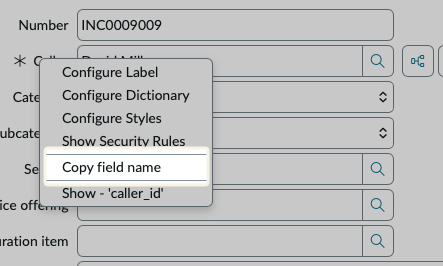

# Copy field name

Small utility to copy the name of a field to the clipboard. In any form, right-click on a field label and select "Copy field name" to copy the field's name to the clipboard. This is especially useful for developers who need to reference field names in code or configuration files.



The xml file contains a copy of the out-of-the-box Macro `element_context` with the addition of a new menu item for copying the field name. The menu item is added to the context menu of the field label, allowing users to easily access this functionality without needing to navigate through additional menus or settings.

```xml
<j:if test="${gs.hasRole('admin')}">
		gcm.addLine();
		gcm.addHref("Copy field name","navigator.clipboard.writeText('${jvar_field_name}');")
	</j:if>
```
